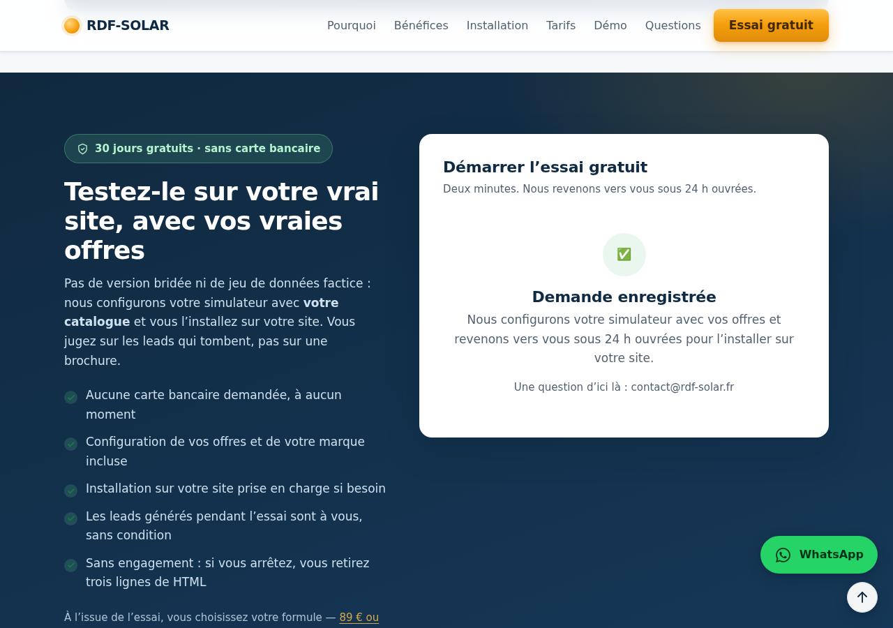

# ☀ RDF-SOLAR — Simulateur d'installation photovoltaïque

Un widget intégrable qui permet à un particulier ou une entreprise, à partir de son **adresse**, de **visualiser sa future installation solaire sur la photo aérienne réelle de son toit**, de choisir ses équipements parmi **vos offres**, et d'obtenir une estimation de production, d'économies et de retour sur investissement — avant de demander un devis.


---

## 0. Qui est qui — à lire avant tout le reste

**Deux entreprises portent le nom « RDF », et les confondre est la source de tous les malentendus de ce projet :**

| Entité | Métier | Rôle ici |
|---|---|---|
| **RDF-SOLAR** | Éditeur de logiciel | **Édite** le simulateur et le vend aux installateurs. Ne pose pas de panneaux. |
| **RDF ENERGIE** | Installateur photovoltaïque | **Utilise** le simulateur sur son site. Premier — et pour l'instant seul — client. |

RDF ENERGIE est notre propre entreprise d'installation, mais elle est traitée dans le code **exactement comme un client tiers** : une entrée `brand` dans un `config/offers.json`, ni plus ni moins. C'est la seule façon de garantir que le deuxième client s'intégrera sans rien réécrire.

Le vocabulaire du dépôt en découle :

| Terme | Désigne | Exemple |
|---|---|---|
| **Vous / votre** | L'**installateur client** (aujourd'hui RDF ENERGIE) | « votre CRM », « vos offres », « votre site » |
| **Le visiteur** | Le particulier qui simule son toit sur le site de l'installateur | il devient un lead |
| **RDF-SOLAR** | L'**éditeur** du simulateur | n'apparaît jamais dans le widget d'un client |

### Le mot « lead » n'a qu'un seul sens ici

Dans le code (`_openLeadModal`, `_submitLead`, `_leadContext`, sujet d'e-mail `[LEAD]`) comme dans cette documentation, **un lead est toujours un lead visiteur** : le particulier qui a simulé son toit et demande un rappel, un WhatsApp ou une visite drone.

**Ce lead appartient à l'installateur, pas à l'éditeur.** Il part vers `brand.devisEndpoint` ou `brand.contactEmail`, tous deux lus dans **son** `config/offers.json`. Aucune coordonnée de visiteur ne transite par RDF-SOLAR : le widget tourne entièrement dans le navigateur et poste directement chez l'installateur.

Aujourd'hui ces leads vont donc chez **RDF ENERGIE**. Que ce soit la même maison que l'éditeur ne change rien : ils sont à traiter comme des leads de RDF ENERGIE, avec ses coordonnées et son CRM. Le jour où un client tiers s'ajoute, la mécanique est déjà la bonne.

Nos propres prospects — les installateurs qui souscrivent au SaaS — **n'apparaissent nulle part dans ce dépôt** : ils relèvent de notre commercial, pas du simulateur. Si vous lisez « lead » dans une issue, une PR ou un commentaire de code, il s'agit du lead visiteur.

### Conséquence pour le code : rien de « RDF-SOLAR » en dur

Tout texte vu par le visiteur qui nomme une entreprise doit passer par `brand.name` (helpers `_brandName()` / `_brandSuffix()` dans `src/rdf-solar-sim.js`). **C'est le nom de l'installateur qui s'affiche — « RDF ENERGIE » — jamais celui du logiciel.** Sans marque configurée, le widget affiche un libellé neutre et **ne se rabat jamais** sur le nom de l'éditeur ni sur `contact@rdf-solar.fr` — un repli de ce genre enverrait chez l'éditeur un lead qui revient à l'installateur. Si aucune destination (`devisEndpoint` ni `contactEmail`) n'est configurée, le visiteur est explicitement renvoyé vers votre téléphone plutôt que de recevoir une fausse confirmation.

### Les deux publics de ce dépôt, et leurs deux CTA

Les deux publics ont désormais **chacun leur page**, ce qui rend la confusion structurellement impossible :

| Page | S'adresse à | Produit… |
|---|---|---|
| **`index.html`** — page de vente | L'installateur, prospect de **RDF-SOLAR** | un **lead SaaS** (essai gratuit) → endpoint configuré, ou `contact@rdf-solar.fr` sujet `[SaaS]` |
| **`demo.html`** — le simulateur | Le particulier, prospect de **RDF ENERGIE** | un **lead visiteur** → RDF ENERGIE |



Le widget affiche la marque **RDF ENERGIE** (`config/offers.json`) : ce n'est pas un décor, c'est le simulateur en production chez notre installateur. Deux conséquences à ne pas perdre de vue :

1. **La collecte est actuellement fermée**, volontairement : `contactEmail`, `phone` et `whatsapp` sont vides tant que les coordonnées commerciales de RDF ENERGIE ne sont pas arbitrées. Le widget masque alors les boutons appel/WhatsApp et prévient honnêtement le visiteur — plutôt que d'envoyer ses leads dans la boîte de l'éditeur, ce qui était le comportement précédent. **Renseigner `brand.contactEmail` (ou `brand.devisEndpoint`) rouvre la collecte**, sans autre changement.
2. **Ne remettez jamais « RDF-SOLAR » dans `brand.name`.** Le champ porte l'installateur ; y mettre le nom du logiciel est exactement la confusion que ce dépôt a mis des mois à traîner — un visiteur en concluait que l'éditeur posait des panneaux.

---

## 0 bis. La page de vente — `index.html`

Page de conversion B2B destinée aux installateurs : promesse, problème métier, bénéfices, fonctionnement, spécifications techniques, essai gratuit et FAQ d'objections.

**Le formulaire d'essai** (`src/rdf-solar-vente.js`) identifie l'entreprise automatiquement : le prospect tape son SIRET ou son nom, et l'API publique [Recherche d'entreprises](https://recherche-entreprises.api.gouv.fr) (gratuite, sans clé, CORS ouvert) renvoie raison sociale, SIRET, adresse, code APE et effectif. Il ne saisit ensuite que son nom, son e-mail et son téléphone.

Trois garde-fous, parce qu'un formulaire qui casse ne convertit pas :

- l'annuaire est injoignable, lent ou change de format → **repli en saisie manuelle**, jamais de blocage ;
- pas d'endpoint configuré → **repli e-mail pré-rempli** vers `contact@rdf-solar.fr`, sujet `[SaaS]` ;
- le POST échoue → **même repli e-mail**. Aucun prospect ne se perd en silence.

**À configurer avant de compter sur la conversion** — un seul objet, à déclarer avant `src/rdf-solar-vente.js` :

```html
<script>window.RDF_SOLAR_VENTE = {
  leadEndpoint: 'https://…',   // CRM, Formspree, Make, n8n… reçoit le lead en POST JSON
  whatsapp: '336xxxxxxxx'      // numéro commercial, format international sans « + »
};</script>
```

- **`leadEndpoint` vide** → la page fonctionne mais passe par `mailto:`, que les webmails et les mobiles gèrent mal : une partie des prospects est perdue à ce moment précis.
- **`whatsapp`** est renseigné (`33614746975`) : le bouton flottant ouvre une conversation avec un message pré-rempli. Vidé, il ramènerait au formulaire d'essai plutôt que vers un numéro inexistant.

### Changer les tarifs

La grille est affichée en clair sur la page — trois formules : **Essentiel 89 € HT/mois**, **Pro 179 € HT/mois** (mise en avant), **Réseau sur devis** à partir de 3 sites, avec deux mois offerts en paiement annuel.

⚠️ **Ces montants sont une proposition, pas une décision commerciale validée.** Ils sont à confirmer avant d'envoyer du trafic sur la page. Pour les changer, quatre endroits, tous dans `index.html` :

1. la section `<section id="tarifs">` — les trois blocs `.prix-n` et leurs listes ;
2. le bandeau de confiance du hero — « À partir de 89 €/mois » ;
3. le bloc d'essai — « 89 € ou 179 € HT par mois » ;
4. la FAQ, question « Que se passe-t-il au bout des 30 jours ? ».

Un commentaire en tête de la section tarifs rappelle cette liste.

### Argumentaire de rapidité

La mise en ligne express est le levier le plus concret de la page, et il est décliné à quatre endroits : le sous-titre du hero (« trois lignes de code »), le bandeau de chiffres (« 3 lignes »), la section « Votre simulateur en ligne cet après-midi » — qui affiche le **code d'intégration réel**, argument décisif pour le webmaster — et le bandeau d'appel à l'action qui la conclut.

Le découpage annoncé est honnête et correspond au fonctionnement réel : 10 minutes d'échange sur le catalogue, configuration par nos soins **sous 24 h ouvrées**, puis 5 minutes pour coller le code. Ne promettez pas « en ligne en 5 minutes » sans la configuration préalable : la mise en service est manuelle (cf. § 0 ter).

### Éléments d'interface à connaître avant d'éditer la page

- **CTA à chaque palier du défilement** : barre de navigation, hero (deux), bandeau après chaque section, bloc preuve, formulaire, FAQ, pied de page. Dix liens mènent au formulaire, six à la démonstration.
- **Bouton WhatsApp flottant** et retour-en-haut, en bas à droite ; sur mobile, une **barre d'action collée en bas** (démo + essai) apparaît une fois le hero passé.
- **Icônes en SVG en ligne** (sprite `<symbol>` en tête de `index.html`), jamais d'emoji : le rendu des emojis varie selon l'OS et déprécie une page commerciale.
- **Apparition au défilement** conditionnée à la classe `js` posée par un script en tête de page. Si le JavaScript ne s'exécute pas, `.reveal` n'est jamais masqué et la page reste entièrement lisible — vérifié navigateur, JS désactivé.

---

## 0 ter. État réel du produit — ce qui existe, et ce qui reste à éprouver

Cette section a longtemps dit « le SaaS n'existe pas ». **Ce n'est plus vrai** : la plateforme
multi-clients est dans `saas/` et tourne sur un VPS. Voici l'état exact.

**Ce qui existe et fonctionne :**

- le **widget** complet — carte IGN, dessin multi-pans, délimitation des maisons mitoyennes,
  géolocalisation, vue 3D, moteur de calcul, TVA 5,5 % conditionnelle, étude imprimable ;
- la **plateforme multi-clients** (`saas/`) — comptes, console éditeur, personnalisation par
  client, activation/coupure, essai de 30 jours, mini-CRM, API `/api/v1` pilotable par agents ;
- le **déploiement VPS** (`deploy/`) — installeur en une commande, nginx, services systemd,
  sauvegardes ;
- la **page de vente** B2B et son formulaire d'essai qualifié par SIRET ;
- la **flotte Hermès** (`agents/`) — capture de prospects par croisement de sources, pipeline
  commercial avec registre d'opposition, rédaction des messages, calendrier de publication ;
- le **white-label par fichier** pour une intégration sans plateforme : un `config/offers.json`.

**Ce qui reste à éprouver — et c'est le point important :**

- **le SaaS n'a qu'un client, et c'est nous** (RDF ENERGIE). Tant que c'est le cas, rien
  n'oblige le code à séparer proprement l'éditeur de l'installateur — et c'est exactement pour
  ça qu'il les avait mélangés. La séparation est faite ; le **deuxième client** est ce qui la
  vérifiera vraiment ;
- la facturation est **déclarative** : aucun prélèvement automatique n'est branché ;
- l'essai gratuit annoncé sur la page de vente est **opéré à la main** — le prospect remplit le
  formulaire, on configure son simulateur, on revient vers lui ;
- les agents Hermès **n'ont jamais tourné contre les API réelles** : l'environnement de
  développement bloque les domaines externes. La logique est testée contre des sources
  simulées en local, mais la première exécution réelle doit être vérifiée à la main.

---

## 1. Analyse de l'existant (pourquoi cet outil est différent)

Les simulateurs du marché se rangent en trois familles :

| Famille | Exemples typiques | Limites |
|---|---|---|
| **Formulaires de devis** | La plupart des installateurs, Hellio | Aucune visualisation ; l'outil sert surtout à collecter un numéro de téléphone |
| **Vue satellite + estimation automatique** | Google Project Sunroof, Otovo, Potentielsolaire (API Google Solar + PVGIS) | Dépendance à l'API Google Solar (payante, couverture incomplète en France) ; pas de choix réel des composants ; peu interactif |
| **Logiciels pro de calepinage** | archelios, PVsyst, Solar Edge Designer | Réservés aux installateurs, trop complexes pour un visiteur de site web |

**Le créneau exploité ici** : la visualisation interactive « pro » (calepinage réaliste sur la vraie photo du toit) mais accessible à un visiteur en 2 minutes, et pilotée par **votre catalogue d'offres** — les dimensions et puissances réelles de vos panneaux déterminent ce qui est affiché sur le toit.

Choix techniques qui vous rendent autonome (0 € de coût de fonctionnement) :

- **Orthophotos IGN** (Géoplateforme) : résolution 20 cm sur toute la France, **gratuites et sans clé API** — meilleure définition que Google Maps dans la plupart des communes.
- **Base Adresse Nationale** pour l'autocomplétion d'adresse, via le service de géocodage de la Géoplateforme IGN (`data.geopf.fr/geocodage`) : gratuit, sans clé. (L'ancienne `api-adresse.data.gouv.fr` a été décommissionnée fin janvier 2026.) En cas d'indisponibilité, un mode « placer la carte moi-même » permet de continuer sans adresse.
- **Moteur d'estimation embarqué** (irradiation par région, facteurs d'inclinaison/orientation, autoconsommation, TVA et projection à 25 ans) : le widget fonctionne intégralement sans serveur.
- **PVGIS** (Commission européenne) pour la production réelle — irradiation satellitaire au point exact, relief environnant et température des modules. PVGIS interdisant les appels depuis un navigateur, un **proxy Node sans dépendance** (`server/pvgis-proxy.js`) est fourni et branché : gratuit, sans clé, avec repli automatique sur le moteur embarqué s'il est indisponible (§ 3 bis).

## 2. Un simulateur orienté génération de leads

**Chiffres à jour du marché français (août 2026).** Le simulateur applique le cadre en vigueur, pas celui d'avant la réforme :

| | Avant | Appliqué par le simulateur |
|---|---|---|
| Prime à l'autoconsommation | 80–180 €/kWc | **0 €** — supprimée par l'arrêté publié au JO le 4 juin 2026 pour toute demande de raccordement déposée à partir de cette date |
| Rachat du surplus | 4 c€/kWh | **1,1 c€/kWh HT**, tarif unique jusqu'à 100 kWc, contrat 20 ans indexé 2 %/an |
| Vente totale ≤ 9 kWc | possible | **interdite** : le résidentiel est en autoconsommation + vente du surplus |
| TVA | 10 % / 20 % | **5,5 %** si les 5 conditions cumulatives sont réunies, **20 %** sinon |
| Prix du kWh réseau | — | 0,2001 €/kWh (tarif réglementé option base au 1er août 2026) |

Conséquence assumée dans tout le parcours : **la rentabilité ne vient plus de la revente mais de l'autoconsommation.** Les résultats décomposent donc explicitement « ce que vous ne payez plus à votre fournisseur » et « ce que vous vendez au réseau » — le second poste ne pesant plus que quelques dizaines d'euros par an.

### Éligibilité à la TVA à 5,5 % — vérifiée et expliquée en direct

Les cinq conditions sont **cumulatives** (une seule manquante = 20 %) et le simulateur les affiche cochées ou non : puissance ≤ 9 kWc · local à usage d'habitation · pose par une entreprise RGE · modules à bilan carbone conforme · **gestionnaire d'énergie (EMS) pilotant au moins 2 usages**. Quand seul l'EMS manque, un bouton l'ajoute d'un clic en affichant le calcul : *« le pilotage coûte 728 € TTC et fait baisser la TVA de 1 293 € : l'opération vous rapporte 565 € »*. C'est l'argument de vente le plus solide qui reste sur le marché résidentiel — et il est chiffré, pas déclamé.

### Dimensionnement conseillé plutôt que « toit rempli »

Couvrir tout le toit n'est plus le bon réflexe : le surplus ne vaut presque plus rien et dépasser 9 kWc fait basculer la TVA à 20 %. Le simulateur classe donc les emplacements du plus au moins productif (ombrage compris), puis retient **le nombre de panneaux qui maximise le gain net sur 25 ans**. Sur une toiture de 12 × 8 m à Lyon avec 4 500 kWh de consommation : 21 panneaux retenus sur 36 possibles, 8,93 kWc — juste sous le seuil de TVA — soit un retour à 14,6 ans au lieu de 19,9 ans si l'on remplit tout. Le visiteur garde la main (« 🏠 Remplir tout le toit », ou clic sur un emplacement libre pour l'ajouter).

### ⚖ Conformité du démarchage téléphonique (depuis le 11 août 2026)

La loi du 30 juin 2025 a réécrit l'article L. 223-1 du code de la consommation : **Bloctel a disparu et le silence vaut refus**. Aucun consommateur ne peut être appelé sans consentement préalable libre, éclairé, spécifique et révocable — valable 1 an, avec **preuve conservée 3 ans**.

Tous les formulaires du widget (rappel, visite drone, demande de devis) comportent donc une case **non pré-cochée** qui bloque l'envoi tant qu'elle n'est pas validée.

La ligne cochée reste courte — elle nomme seulement **qui** appelle, **par quel canal** et **pour quoi**, ce qu'exige un consentement éclairé. Durée, retrait, sort des données et droits d'accès sont sous un **« Détails, durée et vos droits »** replié, discret mais accessible d'un tap (élément `<details>` natif, donc navigable au clavier et par lecteur d'écran). Ouvrir les détails ne coche pas la case. **La preuve transmise contient toujours le texte intégral**, accompagné de ce qui était affiché et de l'information de savoir si le visiteur a déplié les détails :

```json
"consentement": {
  "donne": true,
  "finalite": "Être recontacté par téléphone au sujet d’un projet photovoltaïque",
  "texte": "J’accepte d’être appelé par RDF-SOLAR au sujet de mon projet solaire. Ce consentement ne vaut que pour ce projet, reste valable 1 an …",
  "texteAffiche": "J’accepte d’être appelé par RDF-SOLAR au sujet de mon projet solaire.",
  "texteDetail": "Ce consentement ne vaut que pour ce projet, reste valable 1 an …",
  "detailsOuverts": true,
  "version": "2026-08-13-v2",
  "horodatage": "2026-08-13T13:32:36.305Z",
  "fuseau": "Europe/Paris",
  "dureeValiditeMois": 12,
  "page": "https://www.rdf-solar.fr/simulateur",
  "userAgent": "…",
  "baseLegale": "Article L. 223-1 du code de la consommation (version en vigueur au 11 août 2026)"
}
```

Chaque demande porte aussi une **référence** (`SIM-20260813-1332-C9P4`) affichée au visiteur, et le **détail chiffré de la simulation** (kWc, production, taux de TVA applicable, conditions manquantes, coût HT/TTC) : le conseiller rappelle en connaissant le dossier. La demande de devis passe par le même formulaire que les autres — sans nom ni téléphone, un lead n'est pas exploitable.

### Décrocher à tout moment

À chaque instant du parcours, le visiteur pressé peut décrocher via la **barre de contact permanente** (téléphone cliquable aussi dans l'en-tête) :

- **📞 Appel direct** (`tel:`) — numéro configuré dans `offers.json` → `brand.phone` ;
- **💬 WhatsApp** — le message part pré-rempli avec le contexte de la simulation (adresse, nombre de panneaux, kWc, production, offre choisie) ;
- **⏱ Être rappelé** — formulaire nom + téléphone, promesse « rappel sous 30 min » pendant les horaires ouvrés (détectés côté navigateur, configurables dans `brand.horaires`), « dès l'ouverture » sinon — l'indicateur vert/gris de disponibilité est affiché en permanence ;
- **🚁 Visite technique drone** — réservation d'une visite avec prise de vue aérienne : lien de réservation externe (`brand.droneBookingUrl`, ex. Calendly) ou formulaire intégré avec choix de créneau.

Chaque lead part vers votre CRM (`brand.devisEndpoint`, POST JSON `{type, reference, nom, telephone, email, creneau, contexte, simulation, consentement}`) avec **le résumé complet de la simulation en cours**. Sans endpoint configuré — ou si l'envoi échoue — repli automatique en e-mail pré-rempli vers `brand.contactEmail`, preuve de consentement comprise. Si **ni l'un ni l'autre** n'est renseigné, le visiteur est renvoyé vers `brand.phone` avec un message explicite : le simulateur ne prétend jamais avoir transmis une demande qu'il n'a pas pu router, et ne se rabat jamais sur une adresse de l'éditeur.

## 3. Le parcours utilisateur

1. **Adresse ou géolocalisation** — **« 📍 Je suis chez moi — me localiser »** centre la carte sur la position du visiteur (cas le plus fréquent sur mobile : il simule depuis son salon), pose un repère « vous êtes ici » avec son cercle de précision, et remplit le champ adresse par géocodage inverse pour que le lead reste exploitable. Si la position est imprécise (> 100 m, typiquement sans GPS), le zoom est réduit et le visiteur est averti de vérifier qu'il est bien sur son toit plutôt que sur celui du voisin. Refus, indisponibilité, délai dépassé ou site non sécurisé : message explicite et retour à la saisie d'adresse. Sinon, autocomplétion classique, puis zoom automatique sur la vue aérienne. **L'adresse n'a pas besoin d'être parfaite** : dès que la carte est zoomée sur le quartier, les emprises de tous les bâtiments (BD TOPO IGN) apparaissent, **en surbrillance au survol** — un clic/toucher sur sa maison la sélectionne comme toiture (même si le point géocodé est tombé à côté), relance la détection Google Solar au centre du bâtiment choisi, et d'autres bâtiments peuvent être cumulés de la même façon.
2. **Toiture, pan par pan** — le visiteur dessine un pan en quelques clics, puis **en ajoute autant qu'il veut** (autres pans, annexe, garage, second bâtiment) : chaque pan a **sa propre inclinaison et sa propre orientation**, et tout se cumule dans le calcul. Trois façons de créer un pan : dessin à la main, **« Contour du bâtiment »** (emprise exacte via la BD TOPO de l'IGN, gratuit), ou détection Google Solar (option). Panneaux placés automatiquement (dimensions réelles, marge, portrait/paysage, azimut auto-aligné sur la gouttière), zones à éviter (cheminée, velux) et retrait de panneaux au clic. Liste des pans éditable : sélection, réglage, suppression. Outil **🌳 Arbre** : le visiteur plante les arbres voisins (5/8/12 m, retrait au clic) pour **visualiser leur ombre réelle sur les panneaux dans la vue 3D**, heure par heure et saison par saison — les ombrages Google (`dataLayers`) étant des rasters à traiter côté serveur, cette approche interactive donne le même service sans coût.
**Maison mitoyenne, en bande ou en lotissement.** Le cadastre — comme la BD TOPO — décrit une rangée de pavillons accolés comme **un seul bâtiment** : sans rien faire, le calepinage s'étale sur les toits des voisins. Le simulateur **le détecte** (emprise > 200 m² ou > 22 m de long) et propose spontanément **« ✂️ Délimiter ma maison »** : le visiteur entoure son logement, et plus aucun panneau n'est posé au-delà. La surface de toiture retenue ne compte alors que la sienne, la vue 3D et le devis suivent, et l'information part avec le lead (`maisonDelimitee`). La délimitation accepte les formes concaves (maison en L, décrochés) : la contrainte est appliquée panneau par panneau et la surface calculée par échantillonnage, pas par découpage géométrique.

3. **Offre & équipements** — cartes de **vos** offres + personnalisation panneau / onduleur / **pilotage (EMS)** / batterie ; le toit et le dimensionnement conseillé se mettent à jour en direct. Saisie de la consommation annuelle et de la nature du local (condition de TVA).
4. **Résultats** — production annuelle et mensuelle, taux d'autoconsommation, décomposition des économies (autoconsommé / surplus), **éligibilité TVA 5,5 % détaillée condition par condition**, coût HT / TVA / TTC, retour sur investissement calculé en cumulé sur 25 ans, gain net à l'horizon, CO₂ évité — puis **demande de devis** avec consentement horodaté (e-mail pré-rempli ou envoi vers votre CRM).

**Mobile d'abord** : sur téléphone, la mise en page passe en colonne (saisie d'adresse en tête, carte dessous, hauteur de carte adaptée à chaque étape), le parcours défile automatiquement vers la carte quand on dessine puis revient aux réglages quand un pan est validé, et le tracé se termine par un bouton **« ✓ Terminer »** (avec « ↩ Annuler ») plutôt qu'en re-touchant précisément le premier point. Textes d'aide adaptés au tactile (« Touchez… »), cibles tactiles ≥ 44 px, champs à 16 px (pas de zoom intempestif iOS), barre d'étapes défilable, barre de contact en grille 2×2 et modale de rappel en feuille de bas d'écran.

À tout moment après le dessin du toit : bouton **« 🧊 Vue 3D »** (Three.js) — le bâtiment est reconstruit en volume avec ses panneaux inclinés et ses obstacles, **la photo aérienne IGN est plaquée au sol de la scène** (le client reconnaît son jardin et sa rue), un **soleil positionné astronomiquement** (heure + saison au choix, animation de la journée) projette de **vraies ombres portées** : le client voit l'ombre de sa cheminée balayer les panneaux, la course du soleil en été comme au 21 décembre. Le bouton **« 📷 Photo »** télécharge une image de la scène, reprise dans le récapitulatif. La 3D est optionnelle : si Three.js n'est pas chargé sur la page, le bouton n'apparaît pas et le reste du simulateur fonctionne normalement.

Depuis les résultats : **« 🖨 Imprimer / PDF »** génère une étude personnalisée mise en page (installation, bilan annuel, tableau et graphique mensuels, photo 3D) que le prospect enregistre en PDF — idéale à joindre à la demande de devis.

Confort de dessin : clic droit = annuler le dernier point, Échap = quitter le mode dessin.

## 4. Intégrer le widget sur votre site

Copiez les dossiers `src/`, `vendor/` et `config/`, puis :

```html
<link rel="stylesheet" href="vendor/leaflet/leaflet.css">
<script src="vendor/leaflet/leaflet.js"></script>
<link rel="stylesheet" href="src/rdf-solar-sim.css">
<script src="src/rdf-solar-engine.js"></script>
<script src="src/rdf-solar-sim.js"></script>

<div id="rdf-solar-sim"></div>
<script>
  RDFSolarSim.mount('#rdf-solar-sim', { offersUrl: 'config/offers.json' });
</script>
```

`index.html` est une page de démonstration complète : `python3 -m http.server` à la racine puis http://localhost:8000.

### Options de `mount(selector, options)`

| Option | Défaut | Rôle |
|---|---|---|
| `offersUrl` | `null` | URL du catalogue JSON (sinon catalogue embarqué de secours) |
| `margin` | `0.30` | Marge de sécurité au bord du toit (m) |
| `gap` | `0.02` | Espacement entre panneaux (m) |
| `pvgisProxyUrl` | `null` | URL du proxy PVGIS → production calculée sur données satellitaires réelles, relief inclus (voir § 6) |
| `googleSolarApiKey` | `null` | Clé API Google Solar → détection automatique des pans de toit (voir ci-dessous) |

### Option : détection automatique du toit (API Google Solar)

Sans rien configurer, le visiteur dessine son toit à la main (gratuit, fonctionne partout). Si vous fournissez une clé [Google Solar API](https://developers.google.com/maps/documentation/solar) (`googleSolarApiKey`), le simulateur interroge `buildingInsights:findClosest` après la saisie de l'adresse et liste les **pans détectés**, enrichis des données Google : surface, orientation, pente, **ensoleillement médian (h/an)** et **potentiel de panneaux** du pan. Chaque pan s'ajoute d'un clic et se **cumule** avec les autres (détectés ou dessinés). À savoir : API **payante** (facturation Google Cloud), couverture incomplète en France ; hors couverture, en cas d'erreur ou au-delà de 8 s sans réponse, le simulateur retombe silencieusement sur le dessin manuel.

**Harmonisation automatique des toits à deux versants.** Les boîtes englobantes de Google présentent de légers décalages (faîtages disjoints, largeurs différentes, orientations pas exactement opposées) qui donnent des bâtiments « biscornus » en 3D. Quand deux pans détectés forment un toit à deux versants (orientations quasi opposées, faîtages à moins de 3 m, recouvrement latéral ≥ 50 %), le simulateur les harmonise automatiquement : axe de faîtage commun, arête soudée, largeurs unifiées, orientations rendues exactement opposées et **pentes accordées pour une même hauteur de faîtage** (chaque versant garde sa profondeur réelle). Les pans harmonisés portent le badge ⚖, et la 3D affiche un toit propre.

**Ombres du voisinage intégrées au calcul.** Google modélise le quartier en 3D (bâtiments voisins, arbres, relief) : pour chaque pan ajouté depuis la détection, la production est calculée en **mode précision** — la production annuelle de chaque panneau du calepinage optimal de Google (ombres incluses) est rattachée au panneau le plus proche de notre calepinage, mise à l'échelle de la puissance réelle du panneau choisi et convertie DC→AC selon l'onduleur. Les panneaux notablement ombragés sont **colorés sur la carte** (orange < 85 %, rouge < 65 % du meilleur panneau du pan, avec infobulle) pour être retirés d'un clic. Repli si les données par panneau manquent : **facteur d'ombrage** dérivé de l'ensoleillement médian du pan rapporté au maximum du bâtiment (borné à −45 %). Les pans dessinés à la main restent sur le modèle régional, et le niveau d'intégration de l'ombrage est affiché dans les résultats, le récapitulatif et l'étude imprimable.

Limite à connaître : `buildingInsights` ne fournit **pas les contours exacts** des pans — uniquement des boîtes englobantes (les contours fins n'existent que sous forme d'images raster dans `dataLayers`, inexploitables directement dans un navigateur). C'est pourquoi le bouton **« Contour du bâtiment »** s'appuie plutôt sur la **BD TOPO de l'IGN** (WFS `data.geopf.fr`, gratuit, sans clé) : emprise exacte du bâtiment en un clic, que le visiteur peut ensuite affiner ou découper en pans.

**Gestion sécurisée de la clé** — la clé ne doit jamais être commitée :

1. `cp config/local.example.js config/local.js` puis renseignez-y la clé — `config/local.js` est dans `.gitignore`, il reste sur votre machine/serveur.
2. `index.html` charge ce fichier s'il existe ; `node build-demo.js --local` produit une démo personnelle avec clé (`dist/rdf-solar-demo-personnelle.html`, ignorée par Git elle aussi).
3. Une clé utilisée dans un navigateur est par nature visible des visiteurs : ce qui la protège, ce sont les **restrictions côté Google Cloud Console** → *Credentials* → votre clé : « Application restrictions » = HTTP referrers limités à votre domaine (`https://www.rdf-solar.fr/*`), et « API restrictions » = Solar API uniquement.
4. Si la clé renvoie `403 API_KEY_SERVICE_BLOCKED` : activez « Solar API » dans *APIs & Services → Library* (facturation active requise) et vérifiez que les restrictions d'API de la clé incluent bien Solar API.
5. Une clé qui a circulé en clair (mail, chat…) doit être considérée comme exposée : régénérez-la dans la console après avoir posé les restrictions.

## 4 bis. Production réelle : le proxy PVGIS (gratuit, sans clé)

**PVGIS** est le service de la Commission européenne qui calcule la production photovoltaïque à partir de **données satellitaires long terme**. Par rapport au moteur embarqué, il apporte trois choses qui se voient dans les chiffres :

- l'irradiation **mesurée au point exact** du toit, pas interpolée entre grandes villes ;
- le **relief environnant** (masques lointains issus du modèle d'élévation) — décisif en vallée ou en montagne ;
- la **température des modules mois par mois**, donc une saisonnalité propre à chaque pan : une toiture ouest ne produit pas au même rythme qu'une toiture sud, ce que le profil national moyen ne sait pas représenter.

PVGIS bloque volontairement les appels depuis un navigateur (aucun en-tête CORS). Le dossier `server/` contient donc un petit relais Node **sans aucune dépendance** :

```bash
node server/pvgis-proxy.js          # ou : npm start
curl http://localhost:8787/health
```

puis, côté widget :

```js
RDFSolarSim.mount('#rdf-solar-sim', { pvgisProxyUrl: '/api/pvgis' });
```

En développement, renseignez plutôt `pvgisProxyUrl` dans `config/local.js` (voir `config/local.example.js`) : `index.html` et la démo autonome le lisent automatiquement.

### Ce que fait le widget

Le calcul reste **synchrone et instantané** : le visiteur voit tout de suite l'estimation du moteur embarqué, et les chiffres s'affinent une seconde plus tard sans qu'il ait rien à faire. Un pan interrogé une fois est mémorisé pour toute la session, la source des données est affichée (« données PVGIS ✓ (relief inclus) »), reprise dans l'étude imprimable et jointe au lead. **En cas d'indisponibilité — proxy arrêté, PVGIS en maintenance, réseau coupé — le simulateur garde son estimation locale sans jamais afficher d'erreur ni faire attendre.** Après trois échecs, il cesse d'insister pour la session.

Quand la détection Google Solar est également active, les deux sources se combinent proprement : **PVGIS fournit le gisement** (relief, température) et **Google l'ombrage de proximité** appliqué en relatif — pas de superposition de deux modèles d'irradiation.

### Réglages du proxy

Tout est facultatif, les valeurs par défaut conviennent à un site vitrine :

| Variable | Défaut | Rôle |
|---|---|---|
| `PORT` | `8787` | Port d'écoute |
| `PVGIS_BASE_URL` | PVcalc v5.2 | Endpoint amont — à changer le jour où PVGIS publie une v5.3 |
| `PVGIS_ALLOWED_ORIGIN` | `*` | **À restreindre à votre domaine en production** (liste séparée par des virgules) |
| `PVGIS_CACHE_TTL_MS` | 30 jours | Les moyennes long terme ne bougent pas : un cache long est légitime |
| `PVGIS_CACHE_MAX` | `5000` | Nombre de toits mémorisés |
| `PVGIS_RATE_PER_MIN` | `120` | Quota par IP visiteur |
| `PVGIS_MAX_INFLIGHT` | `4` | Appels simultanés vers PVGIS |
| `PVGIS_TIMEOUT_MS` | `10000` | Délai d'attente amont |

Le proxy **mutualise et protège** : coordonnées arrondies à ~11 m et puissance crête normalisée à 1 kWc, donc deux visiteurs du même toit — ou le même visiteur qui ajoute des panneaux — ne déclenchent qu'un seul appel ; requêtes identiques simultanées fusionnées ; quota par IP ; plafond d'appels concurrents. PVGIS est un service public gratuit : merci de conserver ces garde-fous.

### Mise en production

Derrière nginx, sur le même domaine que le site (pas de CORS à gérer) :

```nginx
location /api/pvgis {
    proxy_pass http://127.0.0.1:8787/api/pvgis;
    proxy_set_header X-Forwarded-For $remote_addr;   # le quota par IP en dépend
}
```

En service systemd :

```ini
[Unit]
Description=Proxy PVGIS RDF-SOLAR
After=network.target

[Service]
ExecStart=/usr/bin/node /var/www/rdf-solar/server/pvgis-proxy.js
Environment=PVGIS_ALLOWED_ORIGIN=https://www.rdf-solar.fr
Restart=always
User=www-data

[Install]
WantedBy=multi-user.target
```

`GET /health` renvoie l'état du cache et les compteurs (succès, échecs, appels amont) — pratique pour la supervision.

## 5. Personnaliser vos offres et votre marque — `config/offers.json`

Tout le commercial est dans ce fichier, modifiable sans toucher au code. **Les prix du catalogue sont des prix HT** (`tarifs.prixHT`) : la TVA est ajoutée par le simulateur au taux réellement applicable.

- **`brand`** : nom, e-mail de contact, `devisEndpoint` (URL POST vers votre CRM), `rge` (indispensable au taux réduit), `politiqueConfidentialiteUrl` et `consentementVersion` (versionne le texte de consentement — à incrémenter à chaque modification du texte, la preuve conservée y fait référence).
- **`tarifs`** : prix du kWh réseau, tarif de rachat du surplus et son indexation, barème de TVA, hypothèses de projection (inflation de l'électricité, dégradation des modules, remplacement d'onduleur, horizon), `bareme` et `dateMaj` — *repris tels quels dans l'étude imprimable pour la rendre opposable*. `primeAutoconsommation` est un **tableau vide** depuis le 4 juin 2026 ; il suffirait d'y remettre des tranches si un dispositif était rétabli.
- **`panneaux`** : puissance, **dimensions réelles** (calepinage) et `basCarbone` (condition de TVA à 5,5 %).
- **`onduleurs`** : le `performanceRatio` de chaque type alimente le calcul de production.
- **`pilotage`** : les gestionnaires d'énergie — `ems: true` valide la condition de TVA, `gainAutoconsommation` chiffre le gain de taux d'autoconsommation apporté par le pilotage.
- **`batteries`** : capacité (améliore le taux d'autoconsommation simulé) et prix.
- **`offres`** : composition (panneau + onduleur + pilotage + batterie), prix HT (`forfaitBase` + `prixParPanneau`), prestations incluses.

> ⚠ Les tarifs et barèmes bougent à chaque arrêté. Mettez à jour `tarifs` **et** `tarifs.dateMaj` : la date s'affiche dans l'étude remise au client.

## 6. Précision des estimations

Le moteur embarqué (`src/rdf-solar-engine.js`) utilise :

- une grille d'irradiation annuelle France/Belgique/Suisse/Luxembourg (interpolation par distance inverse, ordres de grandeur PVGIS) ;
- une table de transposition inclinaison × orientation (interpolation bilinéaire) ;
- le performance ratio de l'onduleur choisi ;
- une courbe empirique d'autoconsommation fonction du ratio production/consommation, bonifiée par la batterie **et par le pilotage (EMS)** ;
- une **projection année par année sur 25 ans** : dégradation des modules (0,4 %/an), inflation du prix du kWh réseau (3 %/an), indexation du tarif d'achat (2 %/an sur 20 ans), maintenance et remplacement d'onduleur si configurés. Le retour sur investissement affiché est celui du **cumul de trésorerie**, pas le ratio « coût / économies de l'année 1 » (qui reste disponible sous `simplePaybackYears`).

Résultat typique du moteur embarqué : ± 10 % par rapport à PVGIS pour une toiture sans ombrage proche. **Avec le proxy PVGIS activé (§ 3 bis), c'est PVGIS qui calcule** — irradiation au point exact, relief et température des modules inclus, saisonnalité propre à chaque pan.

⚠️ Les résultats restent **indicatifs et non contractuels** (le widget l'affiche) : ombrages proches, profils de consommation horaires et évolution des tarifs ne sont pas modélisés. La mention du barème appliqué, sa date et la source des données de production figurent dans les résultats et dans l'étude imprimable.

**Limites connues du modèle, par ordre d'importance :**

1. Le taux d'autoconsommation vient d'une courbe empirique annuelle, pas d'une simulation horaire (8 760 h) avec profil de charge : c'est désormais le paramètre qui détermine la rentabilité, il mérite un modèle horaire.
2. Les arbres plantés par le visiteur servent à la visualisation 3D mais **ne sont pas déduits du calcul** (seules les ombres Google Solar le sont, quand la détection automatique est activée).
3. Le performance ratio est porté par le type d'onduleur, ce qui donne aux micro-onduleurs un avantage uniforme, alors qu'il ne se matérialise réellement qu'en présence d'ombrage. Avec PVGIS il est traduit en pertes système (`loss`), la température étant modélisée par PVGIS lui-même.
4. ~~La saisonnalité suit un profil national fixe~~ — corrigé dès que PVGIS est branché : chaque pan reçoit son propre profil mensuel. Sans PVGIS, le profil national reste utilisé.

## 7. Structure du projet

```
index.html                  Page de vente B2B (installateurs) + formulaire d'essai
demo.html                   Démonstration du simulateur (marque RDF ENERGIE)
src/rdf-solar-vente.css     Styles de la page de vente
src/rdf-solar-vente.js      Formulaire d'essai : recherche entreprise, envoi du lead SaaS
agents/hermes.js            Commande unique de la flotte Hermès
agents/croisement.js        Capture de prospects par croisement de sources
agents/pipeline.js          État des prospects, historique, registre d'opposition
agents/redaction.js         Messages personnalisés → fichiers .eml
agents/publication.js       Calendrier de publications réseaux sociaux
agents/sourcing.js          Sourcing mono-source + extraction des contacts
agents/rge.js               Source annuaire RGE (API ADEME ou CSV local)
src/rdf-solar-engine.js     Moteur : géométrie, calepinage, gisement solaire, finances (testé)
src/rdf-solar-sim.js        Widget : carte, dessin, étapes, offres, résultats, devis
src/rdf-solar-sim.css       Styles (préfixés .rdfsim, sans conflit avec le site hôte)
config/offers.json          Catalogue d'offres, tarifs, barèmes TVA et hypothèses financières
vendor/leaflet/             Leaflet 1.9.4 embarqué (aucun CDN requis)
server/pvgis-proxy.js       Proxy PVGIS : cache, mutualisation, quotas (npm start)
tests/engine.test.js        86 tests du moteur       : node tests/engine.test.js
tests/pvgis-proxy.test.js   44 tests du proxy PVGIS  : node tests/pvgis-proxy.test.js
package.json                Scripts npm (start, test, build) — aucune dépendance
```

```bash
npm test          # moteur + proxy (hors ligne : PVGIS est simulé)
npm start         # proxy PVGIS sur le port 8787
npm run serve     # page de démonstration sur http://localhost:8000
npm run build     # dist/rdf-solar-demo-autonome.html
```

## 8. Le vendre : le SaaS multi-clients

Le simulateur est le produit ; `saas/` est la plateforme qui le vend. Chaque installateur reçoit **son** simulateur à sa marque (logo, couleurs, coordonnées, offres et prix), diffusé par un script de deux lignes, une iframe, un lien direct pour les réseaux sociaux ou une page hébergée optimisée pour le référencement local. Un bouton l'active ou le coupe, un essai de 30 jours se lance d'un clic, et un mini-CRM suit la prospection.

```bash
npm run saas      # http://localhost:8080/console
```

Toute la console passe par l'API `/api/v1` : ce qu'un humain y fait, un agent peut le faire avec un jeton dont le profil (prospection, ventes, dev, secrétariat) ne porte que les portées nécessaires. Aucune dépendance non plus — SQLite est intégré à Node.

Détails, tarifs et déploiement : **[saas/README.md](saas/README.md)**.

## 9. Pistes d'évolution

- **Moteur horaire (8 760 h)** avec profils de charge (chauffage électrique, PAC, ECS, véhicule électrique) et simulation du pilotage : c'est ce qui rendrait le taux d'autoconsommation défendable devant un client.
- **Ombrage réellement calculé** à partir des arbres et bâtiments placés par le visiteur — la scène 3D et le soleil astronomique existent déjà, il manque le lancer de rayons et l'injection du facteur dans le calcul.
- **Alerte urbanisme** : périmètre Monument Historique / site patrimonial remarquable (avis ABF obligatoire, contraintes de teinte, +2 mois de délai), détectable via les données de la Géoplateforme.
- **Dossier administratif pré-rempli** : déclaration préalable (Cerfa 13703), demande de raccordement Enedis (ou ELD), attestation Consuel jaune (15-062).
- **Financement** : mensualité de crédit affecté comparée à l'économie mensuelle.
- Profil d'horizon détaillé (API `printhorizon` de PVGIS) affiché au visiteur — les masques lointains sont déjà pris en compte dans le calcul via PVcalc, mais pas encore montrés.

---

Sources consultées pour l'analyse concurrentielle : [Potentielsolaire](https://www.potentielsolaire.com/), [simulateur Hellio](https://particulier.hellio.com/guide-solaire/fonctionnement/rendement-panneau-solaire/simulation), [calepinage Potentielsolaire](https://www.potentielsolaire.com/calepinage-photovoltaique), [PVGIS — API non interactive](https://joint-research-centre.ec.europa.eu/photovoltaic-geographical-information-system-pvgis/getting-started-pvgis/api-non-interactive-service_en), [PVGIS 5.2](https://joint-research-centre.ec.europa.eu/photovoltaic-geographical-information-system-pvgis/pvgis-releases/pvgis-52_en).

Sources réglementaires des barèmes appliqués (à revérifier à chaque arrêté) : [arrêté tarifaire 2026 — tarif unique 1,1 c€/kWh](https://larevuetech.fr/arrete-tarifaire-photovoltaique-2026-tarif-unique-a-11-ce-kwh-et-nouvelles-regles/), [suppression de la prime à l'autoconsommation](https://www.les-energies-renouvelables.eu/article/actualites/energies/photovoltaique-prime-autoconsommation-supprimee-et-le-tarif-de-rachat-763/), [cadre S21 2026](https://pv-solaire-energie.com/arrete-s21-2026-nouveau-cadre-tarifaire-photovoltaique-pour-lautoconsommation-et-la-vente-du-surplus/), [conditions de la TVA à 5,5 %](https://www.sunethic.fr/tva-panneaux-solaires-5-5-en-2026/), [article L. 223-1 du code de la consommation au 11 août 2026](https://www.legifrance.gouv.fr/codes/section_lc/LEGITEXT000006069565/LEGISCTA000032221441/2026-08-11).

---

## 10. Hermès — les agents commerciaux

`agents/` contient la flotte d'agents chargée de vendre le SaaS aux installateurs.
Le premier maillon est opérationnel :

```bash
node agents/hermes.js capture --departement 69 --pages 3   # trouver et qualifier
node agents/hermes.js suivi                                # où on en est
node agents/hermes.js messages --limite 20 --score 60      # rédiger (n'envoie rien)
```

Il **croise trois sources publiques** — annuaire officiel des entreprises, annuaire RGE de
l'ADEME, et le site de chaque entreprise — pour produire une fiche unique par installateur,
notée, avec la trace de la provenance de chaque information. Il repère les entreprises
**qualifiées Quali'PV qui n'ont pas encore de simulateur** : la cible naturelle de
l'argumentaire. Sortie en CSV, JSON et **tableau de bord HTML** pour travailler la liste.

Attention à ne pas confondre les deux natures de « lead » (cf. § 0) : Hermès démarche des
**installateurs**, le widget collecte des **particuliers** pour le compte de l'installateur.

Architecture complète, limites et cadre légal de la prospection B2B : **[`agents/README.md`](agents/README.md)**.
