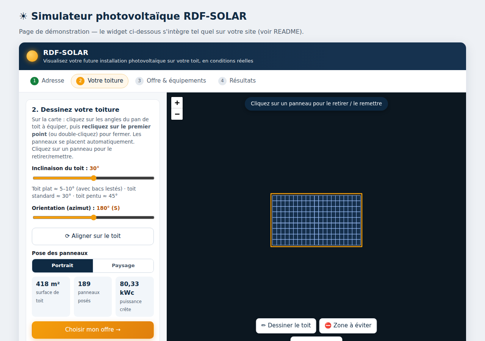

# ☀ RDF-SOLAR — Simulateur d'installation photovoltaïque

Un widget intégrable qui permet à un particulier ou une entreprise, à partir de son **adresse**, de **visualiser sa future installation solaire sur la photo aérienne réelle de son toit**, de choisir ses équipements parmi les **offres RDF-SOLAR**, et d'obtenir une estimation de production, d'économies et de retour sur investissement — avant de demander un devis.



---

## 1. Analyse de l'existant (pourquoi cet outil est différent)

Les simulateurs du marché se rangent en trois familles :

| Famille | Exemples typiques | Limites |
|---|---|---|
| **Formulaires de devis** | La plupart des installateurs, Hellio | Aucune visualisation ; l'outil sert surtout à collecter un numéro de téléphone |
| **Vue satellite + estimation automatique** | Google Project Sunroof, Otovo, Potentielsolaire (API Google Solar + PVGIS) | Dépendance à l'API Google Solar (payante, couverture incomplète en France) ; pas de choix réel des composants ; peu interactif |
| **Logiciels pro de calepinage** | archelios, PVsyst, Solar Edge Designer | Réservés aux installateurs, trop complexes pour un visiteur de site web |

**Le créneau exploité ici** : la visualisation interactive « pro » (calepinage réaliste sur la vraie photo du toit) mais accessible à un visiteur en 2 minutes, et pilotée par **votre catalogue d'offres** — les dimensions et puissances réelles de vos panneaux déterminent ce qui est affiché sur le toit.

Choix techniques qui vous rendent autonome (0 € de coût de fonctionnement) :

- **Orthophotos IGN** (Géoplateforme) : résolution 20 cm sur toute la France, **gratuites et sans clé API** — meilleure définition que Google Maps dans la plupart des communes.
- **Base Adresse Nationale** pour l'autocomplétion d'adresse : gratuite, sans clé.
- **Moteur d'estimation embarqué** (irradiation par région, facteurs d'inclinaison/orientation, autoconsommation) : PVGIS interdit les appels directs depuis un navigateur, le widget fonctionne donc sans serveur ; un **proxy PVGIS optionnel** (`server/`) est fourni pour affiner les chiffres.

## 2. Le parcours utilisateur

1. **Adresse** — autocomplétion, puis zoom automatique sur la vue aérienne du toit.
2. **Toiture** — le visiteur dessine le pan de toit en quelques clics ; les panneaux se placent automatiquement (calepinage aux dimensions réelles du panneau, marge de sécurité, portrait/paysage, inclinaison, azimut auto-aligné sur la gouttière). Zones à éviter (cheminée, velux) et retrait de panneaux au clic.
3. **Offre & équipements** — cartes d'offres RDF-SOLAR + personnalisation panneau / onduleur / batterie ; le toit se met à jour en direct. Saisie de la consommation annuelle.
4. **Résultats** — production annuelle et mensuelle, taux d'autoconsommation, économies, prime, coût indicatif, retour sur investissement, CO₂ évité — puis **demande de devis** (e-mail pré-rempli ou envoi vers votre CRM).

À tout moment après le dessin du toit : bouton **« 🧊 Vue 3D »** (Three.js) — le bâtiment est reconstruit en volume avec ses panneaux inclinés et ses obstacles, **la photo aérienne IGN est plaquée au sol de la scène** (le client reconnaît son jardin et sa rue), un **soleil positionné astronomiquement** (heure + saison au choix, animation de la journée) projette de **vraies ombres portées** : le client voit l'ombre de sa cheminée balayer les panneaux, la course du soleil en été comme au 21 décembre. Le bouton **« 📷 Photo »** télécharge une image de la scène, reprise dans le récapitulatif. La 3D est optionnelle : si Three.js n'est pas chargé sur la page, le bouton n'apparaît pas et le reste du simulateur fonctionne normalement.

Depuis les résultats : **« 🖨 Imprimer / PDF »** génère une étude personnalisée mise en page (installation, bilan annuel, tableau et graphique mensuels, photo 3D) que le prospect enregistre en PDF — idéale à joindre à la demande de devis.

Confort de dessin : clic droit = annuler le dernier point, Échap = quitter le mode dessin.

## 3. Intégrer le widget sur votre site

Copiez les dossiers `src/`, `vendor/` et `config/`, puis :

```html
<link rel="stylesheet" href="vendor/leaflet/leaflet.css">
<script src="vendor/leaflet/leaflet.js"></script>
<link rel="stylesheet" href="src/rdf-solar-sim.css">
<script src="src/rdf-solar-engine.js"></script>
<script src="src/rdf-solar-sim.js"></script>

<div id="rdf-solar-sim"></div>
<script>
  RDFSolarSim.mount('#rdf-solar-sim', { offersUrl: 'config/offers.json' });
</script>
```

`index.html` est une page de démonstration complète : `python3 -m http.server` à la racine puis http://localhost:8000.

### Options de `mount(selector, options)`

| Option | Défaut | Rôle |
|---|---|---|
| `offersUrl` | `null` | URL du catalogue JSON (sinon catalogue embarqué de secours) |
| `margin` | `0.30` | Marge de sécurité au bord du toit (m) |
| `gap` | `0.02` | Espacement entre panneaux (m) |
| `pvgisProxyUrl` | `null` | Endpoint proxy PVGIS pour affiner la production (voir `server/`) |
| `googleSolarApiKey` | `null` | Clé API Google Solar → détection automatique des pans de toit (voir ci-dessous) |

### Option : détection automatique du toit (API Google Solar)

Sans rien configurer, le visiteur dessine son toit à la main (gratuit, fonctionne partout). Si vous fournissez une clé [Google Solar API](https://developers.google.com/maps/documentation/solar) (`googleSolarApiKey`), le simulateur interroge `buildingInsights:findClosest` après la saisie de l'adresse et propose les **pans de toit détectés** (surface, orientation, pente) : un clic pré-remplit le contour, l'inclinaison et l'azimut — le visiteur peut ensuite ajuster. À savoir : API **payante** (facturation Google Cloud), couverture incomplète en France ; hors couverture ou en cas d'erreur, le simulateur retombe silencieusement sur le dessin manuel.

## 4. Personnaliser vos offres — `config/offers.json`

Tout le commercial est dans ce fichier, modifiable sans toucher au code :

- **`brand`** : nom, e-mail de contact des devis, `devisEndpoint` (URL POST vers votre CRM — si vide, le bouton devis ouvre un e-mail pré-rempli avec le récapitulatif complet de la simulation).
- **`tarifs`** : prix du kWh, tarif de rachat du surplus, barème de la prime à l'autoconsommation — *à mettre à jour chaque trimestre selon les arrêtés*.
- **`panneaux`** : puissance **et dimensions réelles** (utilisées pour le calepinage sur le toit).
- **`onduleurs`** : le `performanceRatio` de chaque type alimente le calcul de production.
- **`batteries`** : capacité (améliore le taux d'autoconsommation simulé) et prix.
- **`offres`** : composition (panneau + onduleur + batterie), prix (`forfaitBase` + `prixParPanneau`), prestations incluses.

## 5. Précision des estimations

Le moteur embarqué (`src/rdf-solar-engine.js`) utilise :

- une grille d'irradiation annuelle France/Belgique/Suisse/Luxembourg (interpolation par distance inverse, ordres de grandeur PVGIS) ;
- une table de transposition inclinaison × orientation (interpolation bilinéaire) ;
- le performance ratio de l'onduleur choisi ;
- une courbe empirique d'autoconsommation fonction du ratio production/consommation, bonifiée par la batterie.

Résultat typique : ± 10 % par rapport à PVGIS pour une toiture sans ombrage proche.
Pour affiner : lancez `node server/pvgis-proxy.js` derrière votre domaine et passez `pvgisProxyUrl` au widget — les chiffres PVGIS (Commission européenne) remplacent alors l'estimation locale.

⚠️ Les résultats restent **indicatifs et non contractuels** (le widget l'affiche) : ombrages proches, masques lointains et évolution des tarifs ne sont pas modélisés.

## 6. Structure du projet

```
index.html                  Page de démonstration
src/rdf-solar-engine.js     Moteur : géométrie, calepinage, gisement solaire, finances (testé)
src/rdf-solar-sim.js        Widget : carte, dessin, étapes, offres, résultats, devis
src/rdf-solar-sim.css       Styles (préfixés .rdfsim, sans conflit avec le site hôte)
config/offers.json          Catalogue d'offres et tarifs RDF-SOLAR
vendor/leaflet/             Leaflet 1.9.4 embarqué (aucun CDN requis)
server/pvgis-proxy.js       Proxy PVGIS optionnel (Node, sans dépendance)
tests/engine.test.js        28 tests du moteur : node tests/engine.test.js
```

## 7. Pistes d'évolution

- Détection automatique du contour de toit (API Google Solar en option payante, ou bâtiments BD TOPO de l'IGN).
- Multi-pans (plusieurs polygones avec inclinaisons/orientations différentes).
- Étude d'ombrage horaire (masques lointains via l'API horizon de PVGIS, derrière le proxy).
- Export PDF de la simulation jointe à la demande de devis.

---

Sources consultées pour l'analyse : [Potentielsolaire](https://www.potentielsolaire.com/), [simulateur Hellio](https://particulier.hellio.com/guide-solaire/fonctionnement/rendement-panneau-solaire/simulation), [calepinage Potentielsolaire](https://www.potentielsolaire.com/calepinage-photovoltaique), [PVGIS — API non interactive](https://joint-research-centre.ec.europa.eu/photovoltaic-geographical-information-system-pvgis/getting-started-pvgis/api-non-interactive-service_en), [PVGIS 5.2](https://joint-research-centre.ec.europa.eu/photovoltaic-geographical-information-system-pvgis/pvgis-releases/pvgis-52_en).
